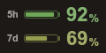
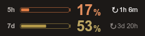

# AI Coding Usage for Flexbar

Display your [Claude Code](https://claude.com/claude-code) usage limits live on your [Flexbar](https://eniacelec.com/products/flexbar) — like a [clawdmeter](https://github.com/HermannBjorgvin/Clawdmeter), but on the macro bar you already own.

By default a **Claude Usage** key shows how much is **left** of both your 5-hour and weekly limits, in as little as 120 px:




A key can instead show one usage limit as a meter: the current percentage used, a progress bar that shifts from green through orange (75%) to red (100%) as usage increases, the time until the limit resets, and optionally Clawd, the Claude Code crab.


The same three key types (usage meter, session status, new session) also exist for [Kimi](#kimi-keys) (Kimi Code CLI and the Kimi desktop app's Kimi Work) and [Gemini](#gemini-keys) (Gemini CLI). They appear in FlexDesigner's key library under "AI Coding Usage", nine keys in all.

The plugin used to be called "Claude Code Usage". Its Claude keys are now listed as **Claude Usage**, **Claude Sessions** (formerly Session Status) and **Claude New Session** (formerly New Session); keys already on your Flexbar keep working with their settings.

## Features

- **5 hours + weekly (remaining)**, the default: both limits on one compact key, as the percentage you have left
- **Session meter** — your 5-hour rolling usage window
- **Weekly meter** — your 7-day usage window (all models)
- **Per-model weekly meter** — the model-scoped weekly limit (e.g. Opus)
- Tap a key to refresh immediately
- No API key needed — reads your existing Claude Code login
- Respects a custom key background color set in FlexDesigner
- Optional Clawd mascot, using the official pixel-art artwork

## Claude Sessions key (Session Status)

A second key, **Claude Sessions**, shows what your latest Claude Code session is doing, so you can see at a glance whether Claude is still working, has finished, or is waiting for you:

| Status | Meaning |
| --- | --- |
| **Working** (blue) | Claude is generating or running a tool (also while background agents run) |
| **Question** (amber) | Claude asked you something (`AskUserQuestion`) — the question is shown |
| **Plan ready** (amber) | A plan is waiting for your approval |
| **Approval** (amber) | A tool call is waiting for your permission. **Approval?** means it is inferred (a tool call has made no progress for 10 s) |
| **Asked you** (amber) | The turn ended with a question in Claude's reply |
| **Done** (green) | The turn finished |
| **Stopped** / **Error** (red) | You interrupted the turn, or it ended with an API error |
| **Idle** (grey) | Nothing happened for a while |

Below the status it shows the question, the current todo item or the session title, and a progress bar when Claude keeps a todo list (e.g. 3/5). The top right shows how long the current state has lasted, plus `+N` when other sessions are also working or waiting.

**Press the key to list all running sessions.** Each row is just a colored dot and the session title, so you can check every session at a glance:

| Dot | Meaning |
| --- | --- |
| Amber | Waiting for you: a question, a plan to approve, or a permission prompt |
| Blue | Working |
| Red | Stopped or ended with an error |
| Green | Completed: the turn finished and the session waits at the prompt |

Sessions waiting for you come first, then working, stopped and completed ones, the most recent first in each group. A session counts as running while its Claude Code process is open, or for the key's idle time (15 minutes by default) after its last activity. The list follows the key's project filter, uses three rows per column and more columns on wider keys, and updates live while it is shown. When it does not fit, a page indicator (e.g. `1/3`) appears bottom right and each further press shows the next page; a press on the last page, or 15 seconds without a press, returns to the normal view.

The key reads the session transcripts Claude Code writes to `~/.claude/projects` (or `CLAUDE_CONFIG_DIR`), plus the live status Claude Code keeps in `~/.claude/sessions`. Everything stays on your computer; nothing is sent anywhere. Sessions from the Claude desktop app's Code tab are included. When several sessions are active, one that is waiting for you is shown first.

**Per key:**

| Setting | Default | Description |
| --- | --- | --- |
| Project filter | empty | Part of the project path; empty shows the latest session of any project |
| Idle after | 15 min | When a finished session counts as idle and leaves the running list |
| Key text language | FlexDesigner language | English or Simplified Chinese |
| Show project name | on | Show the project folder name next to the status |
| Show Clawd | off | Show Clawd on wide keys |

If your Claude Code data is not in `~/.claude`, set the folder in the plugin settings.

## Claude New Session key

A third key, **Claude New Session**, opens a new Claude Code session in the Claude desktop app with one tap — the same page as the app's own "New Claude Code Session" Dock menu item. It uses the app's `claude://code/new` link, so the [Claude desktop app](https://claude.com/download) must be installed.

| Setting | Default | Description |
| --- | --- | --- |
| Project folder | empty | Folder to start the session in: an absolute path or `~/…` (relative paths start from your home folder). Empty lets the app choose |
| Key text language | FlexDesigner language | English or Simplified Chinese |

The key shows "Opening…" briefly after a tap, or "Claude app not found" if no app handles the link (macOS and Linux; on Windows the system shows its own "get an app" prompt instead); taps within a second of each other count once. Keys 100 px wide or narrower show just the icon. The link is handed to the system opener (`open` on macOS, the URL protocol handler on Windows, `xdg-open` on Linux) directly, without a shell.

## Kimi keys

Three keys show Moonshot AI's Kimi Code CLI and the Kimi desktop app's Kimi Work. They look like the Claude keys and carry the Kimi mark (turn it off with **Show Kimi mark**).

**Kimi Usage** shows one Kimi Code plan limit as a meter. It uses the Kimi Code CLI's own login (`~/.kimi-code/credentials/`) and asks the CLI's quota endpoint (`api.kimi.com/coding/v1/usages`, or `api.kimi.ai` for the global service, picked like the CLI does from its environment, `config.toml` and region marker). One request serves every Kimi Usage key, at most one every 30 seconds, with the same rate-limit lockout as Claude.

| Setting | Default | Description |
| --- | --- | --- |
| Usage limit | Default | 5-hour, weekly, monthly, monthly (Kimi Code share), extra usage (booster), or the Kimi Work context. Default shows the 5-hour limit when the plan reports it. Once the settings page has checked your account, limits your plan does not report are marked "not on your plan" (extra usage: "not active") |
| Key text language | FlexDesigner language | English or Simplified Chinese |
| Show time until reset | on | Show the countdown until the limit resets |
| Show Kimi mark | on | Show the Kimi mark next to the meter |

Not every plan reports every limit: some report only the 5-hour and weekly limits, and extra usage only appears while the booster wallet is turned on and has purchased extra usage. A key set to a limit your plan does not report shows the default limit instead (the 5-hour one when the plan has it), with that limit's own label on the meter when the key is wide enough for one, and its settings page says so; your setting is kept, so the key shows the chosen limit again once the plan reports it.

The **Kimi Work context** limit needs no login: it is how full the context window of the running (or latest) Kimi Work task is, read from the Kimi desktop app's data on this computer. On a computer with only the desktop app, it is the only limit available.

When the Kimi Code login has expired, the key refreshes it with the CLI's own protocol: it takes the CLI's refresh lock, refreshes once and writes the new token pair back to the CLI's credential file. Turn off **Refresh an expired Kimi Code login** in the plugin settings to keep the key read-only; it then asks you to run `kimi` instead.

**Kimi Sessions** works like the Claude Sessions key (same states, `+N`, press for the running list). It merges Kimi Code CLI sessions (`~/.kimi-code/sessions`) with the desktop app's Kimi Work tasks. Questions and approvals from Kimi Code 1.5 journals are known, not guessed; a sub-agent waiting for you shows on its parent session. Unread Kimi Work results stay "Done" for up to 12 hours; archived tasks are hidden.

| Setting | Default | Description |
| --- | --- | --- |
| Sessions from | Kimi Code and Kimi Work | Both, only Kimi Work (the Kimi app), or only Kimi Code (CLI) |
| Include scheduled tasks | off | Also show Kimi Work's scheduled tasks |
| Project filter | empty | Part of the Kimi Code project path or the Kimi Work project |
| Idle after | 15 min | When a finished session counts as idle |
| Key text language, Show project name, Show Kimi mark | | As on the Claude key |

**Kimi New Session** opens Kimi Code in a terminal window, or Kimi Work in the Kimi app (`kimi-work://open`, which takes no folder; the key then shows "Kimi Work" instead of a folder name).

| Setting | Default | Description |
| --- | --- | --- |
| Open in | Automatic | Automatic: Kimi Code in a terminal when a folder is set and the CLI is installed, else the Kimi app, else Kimi Code in your home folder. Or always Kimi Work, or always Kimi Code |
| Kimi Code mode | New session | New session, continue the last session (`--continue`), or plan mode (`--plan`) |
| Project folder | empty | Where Kimi Code starts (empty: your home folder) |
| Key text language | FlexDesigner language | English or Simplified Chinese |

A failed tap says why on the key: "Folder not found", "Kimi app not found" or "Kimi not found" ("Cannot open Kimi" when Kimi was found but would not open). With **Open in** set to Kimi Code, a `kimi` the key cannot find in the usual install folders is still started from the terminal's `PATH` (e.g. under nvm); the terminal says so if it is not there.

Requirements: the Kimi Code CLI logged in (`kimi login`) with a Kimi Code plan for plan limits, and/or the Kimi desktop app for Kimi Work. The legacy Python `kimi-cli` (`~/.kimi`) is not read.

## Gemini keys

Three keys show Google's [Gemini CLI](https://github.com/google-gemini/gemini-cli), with the Gemini mark (turn it off with **Show Gemini mark**).

**Gemini Usage** shows Gemini CLI quota as a meter: how much of a model's daily request quota is used. It reads the Gemini CLI login (`~/.gemini/oauth_creds.json`) without ever writing to it: an expired access token is refreshed in memory only, with the OAuth client of the Gemini CLI installed on this computer. It then asks Gemini Code Assist (`cloudcode-pa.googleapis.com`) for the account's tier (at most hourly) and per-model quota (each poll, at most once every 30 seconds).

| Setting | Default | Description |
| --- | --- | --- |
| Usage limit | Default | Default: the model with the least quota left (its name is on the chip). Pro or Flash: the most used model of that family. Auto: Pro and Flash together. Or any single model the account reports |
| Key text language | FlexDesigner language | English or Simplified Chinese |
| Show time until reset | on | Show the countdown until the quota resets |
| Show Gemini mark | on | Show the Gemini mark next to the meter |

Only Gemini CLI's "Login with Google" on a **Gemini Code Assist Standard or Enterprise** subscription reports quota. For personal Google accounts (Code Assist for individuals, Google AI Pro and Ultra) Google answers that the account is not eligible, and API-key logins or Vertex AI have no quota endpoint; the key then says so ("Not supported", "No quota") instead of a meter. If your organization's account needs a Google Cloud project, enter it as **Gemini Cloud project** in the plugin settings (or set `GOOGLE_CLOUD_PROJECT`). A short network or server error keeps the last meter for up to 30 minutes.

**Gemini Sessions** works like the Claude Sessions key. It reads the session files Gemini CLI writes to `~/.gemini/tmp/<project>/chats/` (both the JSON and the newer JSONL format) and names projects by their folder. With **Follow running Gemini CLIs** on (the default), it also reads the process list every 10 seconds (`ps` and `lsof` on macOS, `/proc` on Linux; not on Windows) to tell running sessions from stopped ones, to see tools running, and to show a freshly started CLI as "New session". Gemini CLI does not record pending approvals, so **Approval?** is a guess (a reply with no text and no tool running for 10 seconds). It rarely fires: Gemini CLI writes a reply, and its tool calls, only once the tools have finished, and such replies nearly always have text. So while a tool waits for your approval, or an `ask_user` question waits for your answer, the key usually still shows the previous reply as **Done** until the tool finishes.

| Setting | Default | Description |
| --- | --- | --- |
| Follow running Gemini CLIs | on | Read the process list; off judges from the session files only |
| Project filter, Idle after, Key text language, Show project name, Show Gemini mark | | As on the Claude key |

**Gemini New Session** opens a terminal window running the Gemini CLI in the key's folder: on macOS a temporary `.command` script (it deletes itself; one Terminal never ran is removed a minute later) opened in Terminal, on Windows a `cmd` window, on Linux `x-terminal-emulator`. Every argument is passed as-is, never through a shell string. On Windows a program path with a character `cmd.exe` would act on (`& | < > ^ % ! ( ) "`) is refused rather than run. Kimi New Session opens Kimi Code the same way.

| Setting | Default | Description |
| --- | --- | --- |
| Open in | Terminal (Gemini CLI) | Or a new chat in the Gemini app (`googlegemini://newchat`; no folder, not a CLI session; the key shows "Gemini app" instead of a folder name) |
| Approval mode | Ask (default) | Ask, auto-approve edits, approve everything (YOLO), or plan (read-only) |
| Resume latest session | off | Start with `--resume latest` |
| Project folder | empty | Where the CLI starts (empty: your home folder) |
| Key text language | FlexDesigner language | English or Simplified Chinese |

A failed tap says why on the key: "Folder not found", "Gemini CLI not found" or "Gemini app not found". The CLI is found through the **Gemini CLI program** setting, else `PATH` and the usual install folders (Homebrew, npm, Volta, Bun, pnpm, nvm).

Requirements: [Gemini CLI](https://github.com/google-gemini/gemini-cli) installed (and, for the usage key, logged in with Google on a Code Assist Standard or Enterprise account).

## How it works

The plugin reads the OAuth token that Claude Code stores on your machine (`~/.claude/.credentials.json`, or the Keychain on macOS) and polls the same usage endpoint that Claude Code's own `/usage` command uses. Usage polling costs no tokens and nothing is sent anywhere except to `api.anthropic.com`.

One usage request serves all keys, at most one request every 30 seconds. If the endpoint rate-limits the plugin (HTTP 429), it honors the server's `Retry-After`: keys show a countdown until usage data returns, and no requests are made until then.

When the stored token expires, the plugin refreshes it the same way Claude Code does (via the stored refresh token) and writes the new token pair back to the credential store — so the meters keep working even if you only use the Claude desktop app and never run the CLI. If the refresh token itself has been revoked, keys ask you to log in with Claude Code again.

Requirements:

- [Claude Code](https://claude.com/claude-code) installed and logged in on the same computer
- A Claude subscription (Pro / Max) — API-key-only accounts have no usage limits to display

## Privacy

- The plugin reads your Claude Code credentials locally (`~/.claude/.credentials.json`, `CLAUDE_CODE_OAUTH_TOKEN`, or the macOS Keychain) and sends them only to Anthropic's own endpoints: the usage endpoint on `api.anthropic.com`, and the OAuth token endpoint (`platform.claude.com`, falling back to `console.anthropic.com`) when it refreshes an expired token.
- Tokens are never logged or shown on a key; error messages are redacted before they reach the FlexDesigner log or the settings page. A refreshed token pair is written back only to the credential store it came from.
- The Claude Sessions key reads transcripts and session status locally and sends nothing anywhere.
- The Claude New Session key only hands a `claude://` link to your system's opener and sends nothing anywhere; its log messages leave out the project folder.
- Kimi Usage sends the Kimi Code login only to the endpoints the Kimi Code CLI itself uses (by default `api.kimi.com` / `auth.kimi.com`, or `api.kimi.ai` / `auth.kimi.ai`; overridden, like the CLI, by its `config.toml` or `KIMI_CODE_BASE_URL` / `KIMI_CODE_OAUTH_HOST`), and only over https. When the quota endpoint keeps refusing a freshly refreshed login, it does not refresh again until another login is stored. With login refresh on, it rewrites the Kimi Code CLI's credential file under the CLI's own lock; with it off, it writes nothing. The Kimi desktop app's credentials are never read.
- Gemini Usage sends the Gemini CLI login only to Google (`oauth2.googleapis.com` to refresh the access token in memory, `cloudcode-pa.googleapis.com` for the quota) and never writes to `~/.gemini`.
- The Kimi and Gemini Sessions keys only read local files (and, for Gemini, the process list); they write nothing and send nothing anywhere. Session titles and prompts never reach the log.
- No credentials or personal data are stored in this repository. Contributors: run `npm run setup:hooks` once, list your own identifiers (user name, hostname, device serial, email) in the git-ignored `.privacy-denylist.local`, and run `npm run check:privacy` before pushing; the rules are in [CLAUDE.md](CLAUDE.md#privacy-rules-mandatory).

## Installation

Install from [Flexgate](https://flexgate.enilinx.com/), or download the `.flexplugin` file from the [latest release](https://github.com/Sese-Schneider/flexbar-claude-code-usage/releases) and install it via FlexDesigner.

## Configuration

**Global settings** (plugin config page; the refresh interval applies to every provider, the rest is grouped by provider):

| Setting | Default | Description |
| --- | --- | --- |
| Refresh interval | 180 s | How often usage is polled, for every provider (minimum 60 s) |
| Credentials file | auto-detect | Override path to `.credentials.json` (useful with `CLAUDE_CONFIG_DIR`) |
| Claude Code folder | auto-detect | Override `~/.claude` for Claude Sessions keys |
| Kimi Code folder | auto-detect | Override `$KIMI_CODE_HOME` or `~/.kimi-code` (login, sessions, `bin/kimi`) |
| Kimi desktop app data folder | auto-detect | Override the Kimi app's data folder (`~/Library/Application Support/kimi-desktop` on macOS) |
| Refresh an expired Kimi Code login | on | Let Kimi Usage refresh and write back an expired Kimi Code login; off keeps it read-only |
| Gemini CLI folder | auto-detect | Override `$GEMINI_CLI_HOME/.gemini` or `~/.gemini` |
| Gemini CLI program | auto-detect | Path to the `gemini` program, if it is not found on `PATH` or the usual install folders |
| Gemini Cloud project | empty | Google Cloud project ID for Gemini Code Assist Standard or Enterprise quota (default `$GOOGLE_CLOUD_PROJECT`) |

**Per key** (Claude Usage; the Kimi and Gemini keys are described above):

| Setting | Default | Description |
| --- | --- | --- |
| Usage limit | 5 hours + weekly (remaining) | 5 hours + weekly (remaining), or one limit as used: Session (5 hours), Weekly (all models), or Weekly (per model) |
| Show time until reset | on | Show the countdown until the limit resets |
| Show Clawd | off | Show Clawd, the Claude Code crab, next to the meter (single-limit meters on keys from about 170 px) |

**5 hours + weekly (remaining)** shows the 5-hour window in the top row (`5h`) and the weekly window, all models, in the bottom row (`7d`). The number is what is left, 100% minus what you have used: green while plenty is left, orange as it runs low, red when almost nothing is left. The gauge is a battery that empties as you use the limit; next to a full battery the number reads `100`, without the `%`. From about 135 px the time until each limit resets (↻) appears above its battery, and from about 225 px in a column of its own. Between about 97 and 135 px only a limit that has run out shows it, in place of its empty battery and where it fits: any countdown fits from about 113 px, so the default 120 px key always shows it. Keys narrower than about 97 px leave out the batteries and the countdowns.

New Claude Usage keys are 120 px wide. At that width a single-limit meter names its limit with a short `5h` or `7d` chip; on wider keys the chip says Session or Weekly.

In the single-limit meters the countdown sits next to the percentage; on narrow keys with Clawd enabled it moves below the progress bar. A custom background color set in the key's style editor is used as the key background in every mode.

## Development

```bash
npm install
npm run build          # bundle src/ -> <plugin>/backend/plugin.cjs
npm run dev            # link into FlexDesigner + watch + debug
npm run plugin:pack    # produce dev.sese.flexbar_claude_code_usage.flexplugin
```

FlexDesigner must be running for `npm run dev`.

## License

[MIT](LICENSE)
